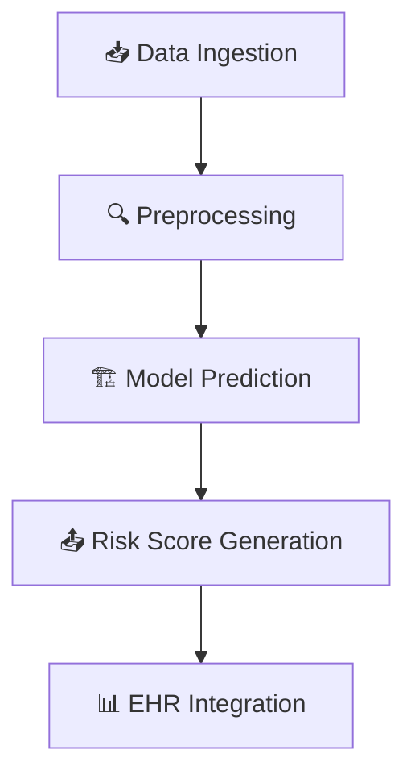

# ❤️ ARISE.ai: Transforming Heart Failure Risk Prediction  

ARISE.ai is an **advanced AI-driven healthcare solution** designed to tackle the **global burden of heart failure readmissions**. By leveraging **cutting-edge AI models**, our system assists clinicians in **identifying high-risk patients early**, reducing complications, and **optimizing patient care** for **better health outcomes and cost savings**.

---

## ⚠️ Problem Statement  
Heart failure readmission is a **major healthcare crisis**, with over **20-25% of heart failure patients** being readmitted within **30 days**. This leads to:

🔴 **Increased mortality rates** due to delayed interventions  
🔴 **Higher healthcare costs**, burdening both patients and hospitals  
🔴 **Limited hospital resources**, reducing overall care efficiency  

The inability to accurately **predict readmission risk** means hospitals struggle with **reactive care** rather than **preventive treatment**, leading to **avoidable complications** and **strained medical infrastructure**.

### 🔎 Need for a Solution  
🔹 **Early identification of high-risk patients** allows hospitals to intervene proactively  
🔹 **Predictive AI models** help reduce hospital stays and unnecessary readmissions  
🔹 **Resource-limited settings need interpretable AI tools** for better clinical decision-making  
🔹 **Accurate, actionable risk scores** ensure **personalized patient management**  

ARISE.ai bridges this gap by providing **clinicians with an intelligent, evidence-driven solution**, enabling them to **focus resources where they matter most**.

---

## 💡 AI-Powered Risk Prediction  
### **🦾 How It Works**  
Our **AI-powered risk prediction system** integrates **real-world patient data** and applies advanced **machine learning techniques** to assess **heart failure readmission probability**.  

**Key Benefits:**  
✅ **93.27% accuracy**, outperforming conventional risk models  
✅ **Data-driven recommendations**, aiding clinical decision-making  
✅ **Customizable risk thresholds**, tailored to hospital needs  
✅ **Adaptive AI**, improving predictions as more data is analyzed  

ARISE.ai generates **clinically actionable risk scores**, empowering healthcare professionals to **optimize interventions, reduce complications, and improve patient outcomes**.

---

## 🎯 Key Features  
❤️ **AI-powered predictive analytics** – identifies high-risk patients  
🧠 **Clinically interpretable risk scoring** – enables actionable decisions  
📊 **Real-time EHR integration** – ensures seamless hospital workflow  
🛠 **Customizable model tuning** – adapts to hospital-specific needs  
🔍 **Transparent AI explanations** – keeps medical professionals informed  
📈 **Optimized resource allocation** – reduces strain on healthcare facilities  

---

## 🏗️ About the Solution  
### **📊 Model Performance**  
Our **Random Forest model** strikes the perfect balance between **accuracy, interpretability, and robustness**.  

| Metric      | Score |
|------------|------|
| **Accuracy**  | 93.27% |
| **Precision** | 91.85% |
| **Recall**    | 92.30% |
| **F1-Score**  | 92.07% |

🔄 **Why Random Forest?**  
✔ **Handles imbalanced datasets efficiently**  
✔ **Outperforms traditional regression models**  
✔ **More interpretable than deep learning-based black-box models**  

---

## 🔧 Architecture Overview  
### **Data Flow Representation**  

---

## 💰 Business Model & Unique Selling Proposition  
### **🌟 Revenue Streams**  
1️⃣ **Hospital Partnerships** – Subscription-based AI decision support  
2️⃣ **EHR Vendors** – Integration licensing  
3️⃣ **Clinical Research Institutions** – Data-driven analytics  

### **🛠️ Unique Features**  
⭐ **Clinically Interpretable Risk Scoring**  
⭐ **Seamless EHR Integration**  
⭐ **Actionable Recommendations for Clinicians**  

---

## 🎥 Product Demo  
❤️ https://drive.google.com/file/d/1-ImvFqNMG_lfzZ1eleN2JaeJ_zIakUoj/view?usp=sharing

  

---

## 🤝 Call to Action  
❤️ **We are open to collaboration!** Contribute, provide feedback, and help advance AI in healthcare:  
✅ **Fork & Star** this repository  
✅ Open **Issues & PRs**  
✅ Join our **Developer Community**  

📧 *Reach out to us:* [rishrishit@gmail.com](mailto:rishrishit@gmail.com)
